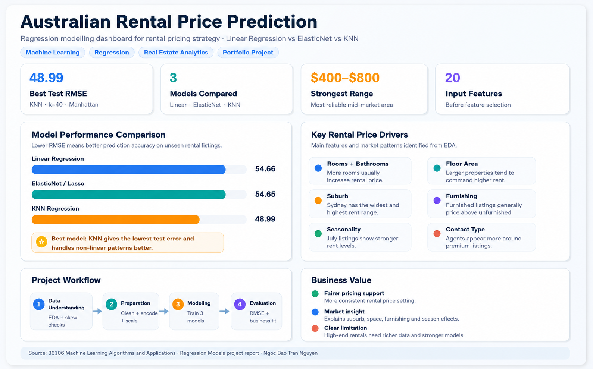

# 🏠 Australian Rental Price Prediction

Machine learning dashboard for predicting Australian rental prices using property features, furnishing status, and seasonal rental trends.

---

## 📌 Project Overview

This project explores how machine learning models can estimate rental prices across Australian properties using structured housing data.

The workflow includes:
- Data cleaning & preprocessing
- Feature engineering
- Model training & evaluation
- Interactive Streamlit dashboard deployment

The project compares multiple regression models and identifies the strongest-performing approach for capturing non-linear rental pricing patterns.

---

## 🚀 Live Dashboard

🔗 Streamlit App: [Launch Prediction App](https://australian-rental-price-prediction-fqoxvtlf33qtrlpxrnx7il.streamlit.app/)

🔗 Power BI:
[View Interactive Dashboard](https://app.powerbi.com/view?r=eyJrIjoiOGRmZWM1OTUtMmZjOS00YmFhLTkxMTMtNTNmMzRjNTFiZjliIiwidCI6ImYwMjU1MTVhLTNhNGUtNDJhNC1hYmZkLWI2MjliNWI3NmQ4NSJ9)

---

## 📊 Dashboard Preview



---

## ⚙️ Machine Learning Pipeline

```text
Data Cleaning
    ↓
Feature Engineering
    ↓
Encoding
    ↓
Feature Scaling
    ↓
Hyperparameter Tuning
    ↓
Model Evaluation
```

---
## 🤖 Models Compared
| Model             | RMSE  |
| ----------------- | ----- |
| KNN Regression    | 48.99 |
| ElasticNet        | 54.65 |
| Linear Regression | 54.66 |

✅ KNN Regression achieved the best predictive performance by capturing non-linear rental relationships more effectively than linear models.

---
## 📈 Key Insights
- Larger floor areas generally increase rental prices
- Bedrooms and bathrooms positively correlate with rent
- Seasonal trends influence rental demand and pricing
- Non-linear models outperform traditional linear approaches
  
---
## 🛠️ Tech Stack
- Python
- Pandas
- Scikit-learn
- Plotly
- Streamlit

---
## 📂 Repository Structure

```text
Australian-rental-price-prediction/
│
├── assets/
│   └── AU_rental_price_prediction.png
│
├── dataset/
│   ├── rental_training.csv
│   ├── rental_validation.csv
│   └── rental_testing.csv
│
├── notebooks/
│   ├── setup_env_&_baseline_experiment.ipynb
│   ├── Linear_experiment.ipynb
│   ├── ElasticNet_experiment.ipynb
│   └── KNN_experiment.ipynb
│
├── streamlit_dashboard/
│   └── app.py
│
├── requirements.txt
├── README.md
├── LICENSE
└── .gitignore
```

---
## ▶️ Run Locally

Clone the repository:

```bash
git clone https://github.com/tracynguyen01/Australian-rental-price-prediction.git
```

Install dependencies:

```bash
pip install -r requirements.txt
```

Run Streamlit dashboard:

```bash
streamlit run streamlit_dashboard/app.py
```

---
## 📌 Future Improvements
- Add XGBoost and Random Forest models
- Integrate suburb-level geospatial analysis
- Connect live rental market APIs
- Deploy automated model retraining pipeline

---
## 👩‍💻 Author
**Ngoc Bao Tran (Tracy) Nguyen**
